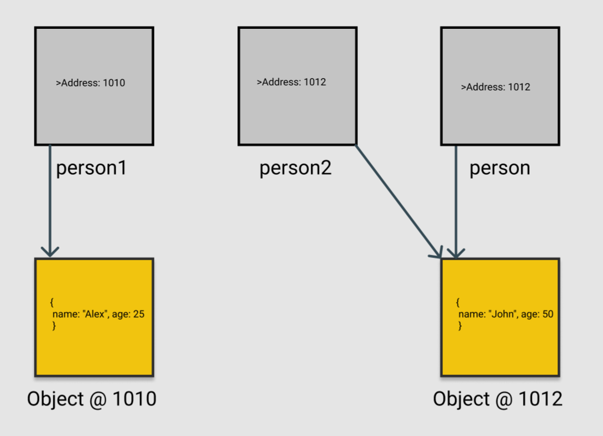

1. What will be the output and explain the reason.

```js
let obj = { name: "Arya" };
obj = { surname: "Stark" };
let newObj = { name: "Arya" };
let user = obj;
let arr = ["Hi"];
let arr2 = arr;
```

Answer the following with reason after going through the above code:

- `[10] === [10]`

This will simply output a string [10] === [10].

- What is the value of obj?

obj = { surname: 'Stark' } - This last assignment will overwrite the previous one.

- `obj == newObj`

false - Since the two objects point to two different objects on the memory stack.

- `obj === newObj`

false - Since the two objects point to two different objects on the memory stack.

- `user === newObj`

false - Since the two objects point to two different objects on the memory stack.

- `user == newObj`

false - Since the two objects point to two different objects on the memory stack.

- `user == obj`

true - The two objects point to the same object on the memory stack.

- `arr == arr2`

true - The two arrays point to the same array on the memory stack.

- `arr === arr2`

true - The two arrays point to the same array on the memory stack.

2. What's will be the value of `person1` and `person2` ? Explain with reason. Draw the memory representation diagram.

<!-- To add this image here use  -->



```js
function personDetails(person) {
  person.age = 25;
  person = { name: "John", age: 50 };
  return person;
}
var person1 = { name: "Alex", age: 30 };
var person2 = personDetails(person1);
console.log(person1);
console.log(person2);
```

2. The output of person1 -- {name: "Alex", age: 25}
   person2 -- {name: "John, age: 50}
   The reference value of person1 gets passed to the function and hence in the parameter person. Thus, they both point to the same object in memory. Now, with this - person.age = 25, the object gets updated and both of the variables will now point to the updated object. In the next step, person gets assigned to a new object altogether { name: "John", age: 50 } and this value gets returned to person2.

3. What will be the output of the below code:

```js
var brothers = ["Bran", "John"];
var user = {
  name: "Sansa",
};
user.brothers = brothers;
brothers.push("Robb");
console.log(user.brothers === brothers); //1. true - because both the references point to the same object on the memory heap
console.log(user.brothers.length === brothers.length); //2. true - because both the references point to the same object on the memory heap
```
